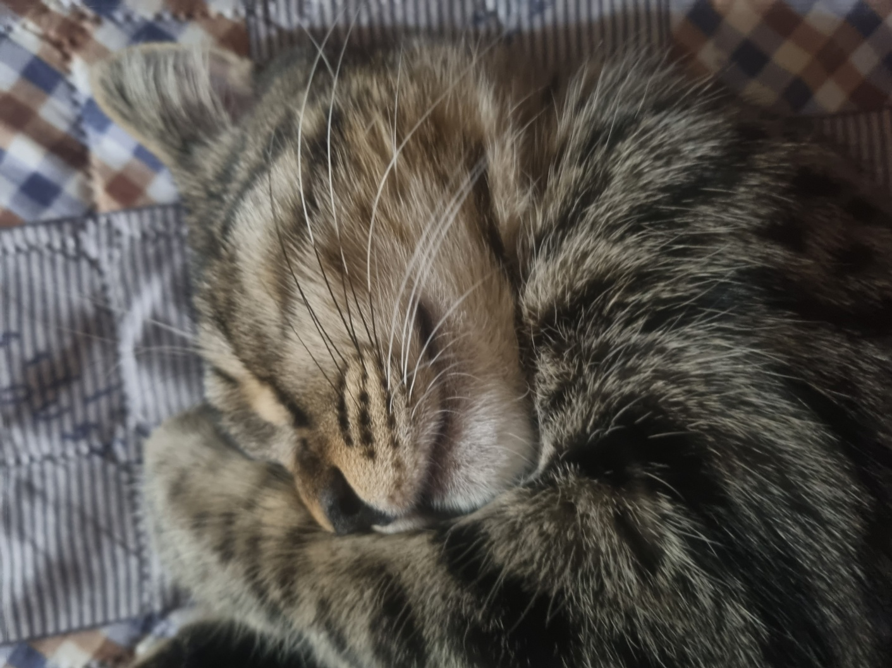

# 🐾 Run-cat — **금은동 달려**

> 🐱 **금은동**을 너무 아껴서 만든 집사의 러닝 게임!  
> 개발자 집사 🖥 + 사운드 디자인 집사 🎧가 함께 제작했습니다.

---

## 🐱 주인공 — 금은동

---

## 🎮 게임 개요
| 항목 | 내용 |
|------|------|
| **장르** | 러닝 액션 게임 |
| **주인공** | 금은동 (집사들의 고양이) |
| **제작 배경** | 유튜브 콘텐츠 기반 제작 |
| **그래픽** | 일부 무료 에셋 + 나머지 직접 제작 |

---

## 🖼 게임 화면

### 🏁 시작 화면
스페이스바 **`Space`** 클릭 시 게임이 시작됩니다.  

---

### 🚀 플레이 화면
- 💥 **장애물 충돌** → 생명 ❤️ -1  
- ✨ **골든 츄르** → **5초 무적 상태**  
- 🍖 **뼈다귀 / 츄르 아이템** → 생명 회복 ❤️

---

## 🛠 사용 기술
- **개발 언어:** `C#`
- **사운드 엔진:** `Wwise`
- **게임 엔진:** `Unity`
- **디자인:** 일부 무료 에셋 + 직접 제작

---

## 📅 프로젝트 관리
📌 [**Notion 프로젝트 페이지 바로가기**](https://www.notion.so/1de564d4aff3802db390d2e2cb2615a3)

---

> 💡 *"금은동을 위한, 금은동에 의한, 금은동의 게임"*
